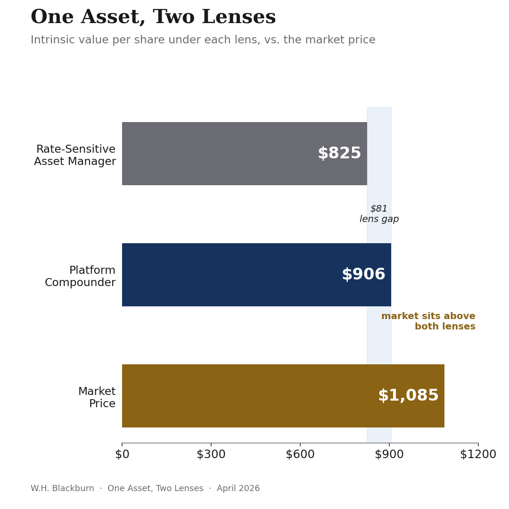
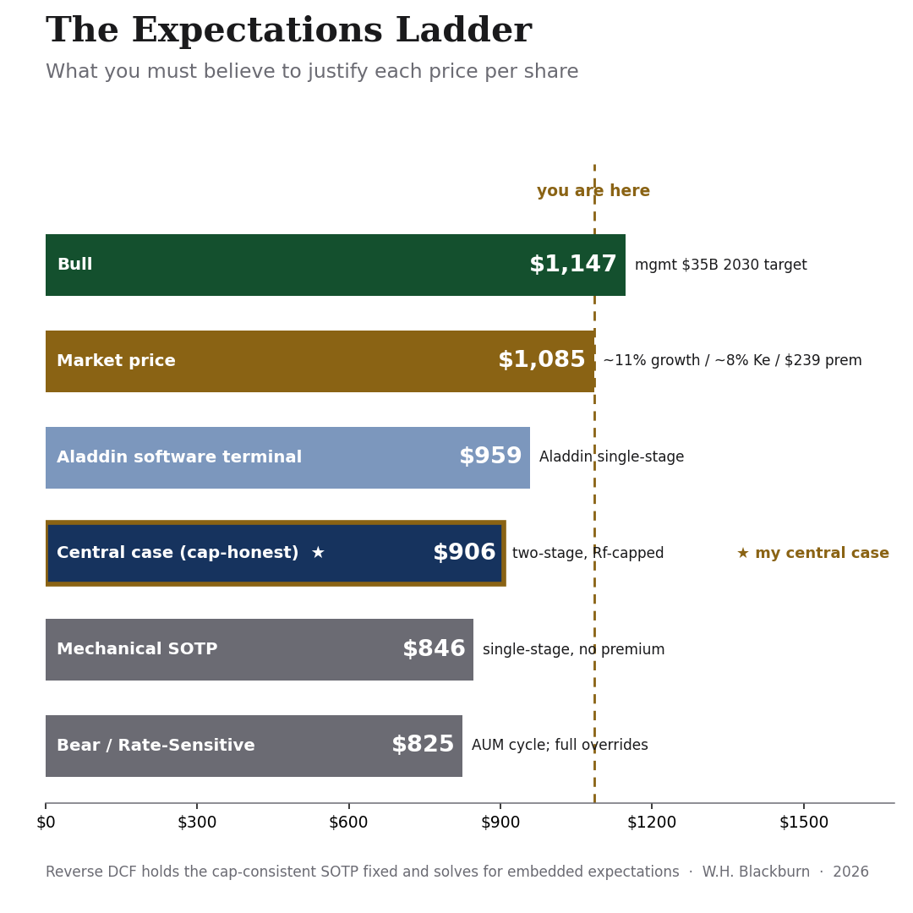
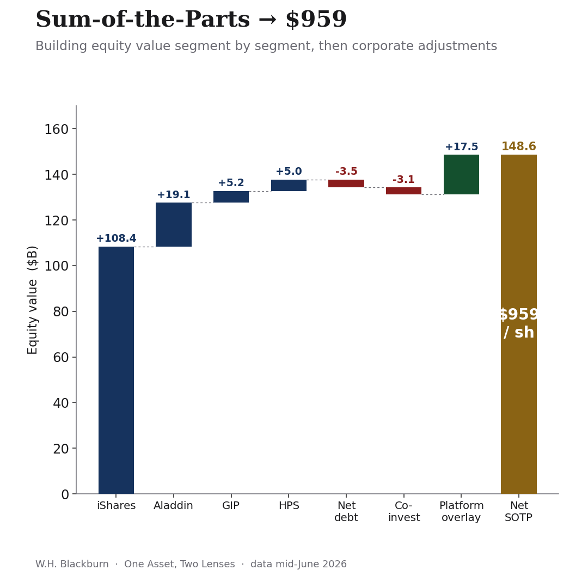
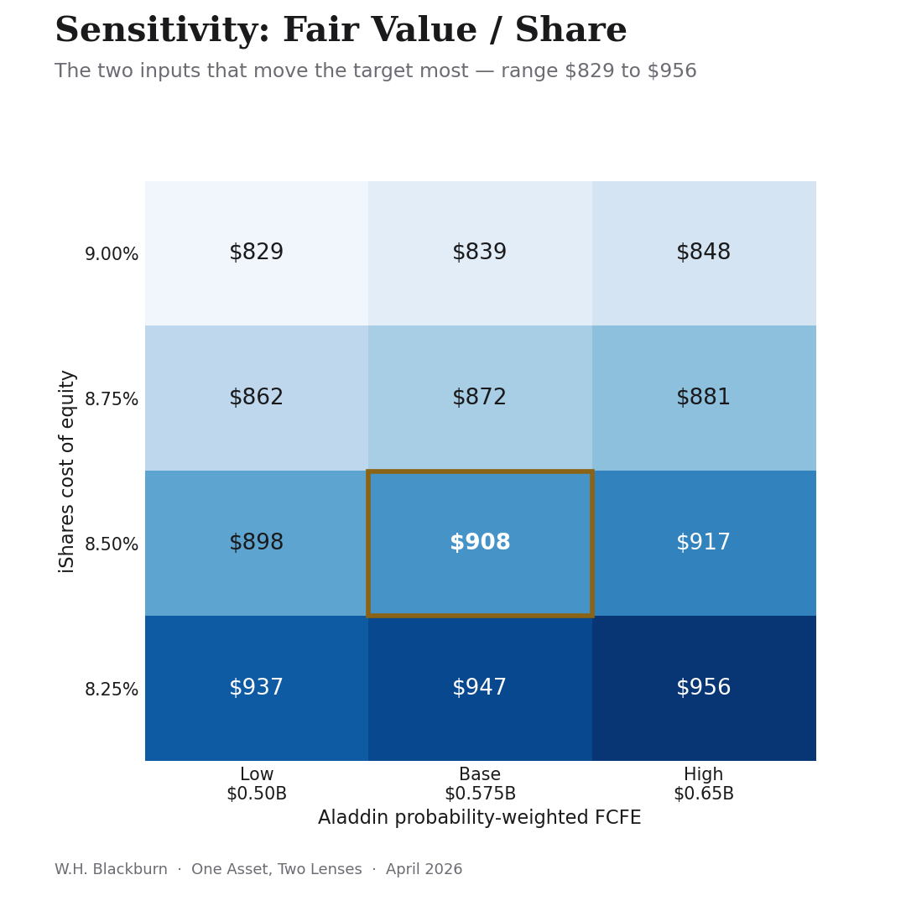

# BlackRock: One Asset, Two Lenses
### An Investment Thesis & Intrinsic Value Assessment

> **Recommendation: HOLD with a trim bias** · Target **$906** · Price **$1,085** · **−16.5%** to fair value
> Accumulate <$900, where the two lenses converge.

---

## The Argument

The valuation gap reflects a fundamental disagreement about what BlackRock actually is. The interesting question isn't whether the SOTP says $906 or $959—it's whether BlackRock's ecosystem of segments makes it worth more together than apart. See the full intellectual centerpiece: [**What is BlackRock?**](methodology/what_is_blackrock.md)

---
## Overview

Most BlackRock valuations begin with a single assumption: *BlackRock is an asset manager.*

This project starts with a different question: **what if BlackRock is actually two businesses sharing one ticker?**

Using a segment-level sum-of-the-parts (SOTP) framework, geographic equity risk premia, and cash-flow-based valuation, I value BlackRock under two competing lenses:

- **Rate-Sensitive Asset Manager** — a levered claim on the level of global markets → **~$825/share**
- **Platform Compounder** — an ETF utility fused to a software franchise (Aladdin) and private-market cash flows that don't move one-for-one with equities → **~$906/share**

The resulting valuation gap exceeds **$80 per share**. The objective is not to forecast the next quarter; it is to determine which lens better explains the economics of the business — and whether the market is pricing BlackRock appropriately today.



## What makes this different

- **A framework, not a number.** The two-lens construction is the spine of the whole analysis; every valuation conclusion flows from it.
- **Segment-level discounting.** Each business is discounted at its own cost of equity rather than one blended rate on consolidated cash flows.
- **Disclosed judgment.** Every place where analyst judgment overrides mechanical source data is itemized, with magnitude and rationale.
- **Stress-tested against reality.** The thesis incorporates BlackRock's March 2026 private-credit redemption gating — the first live test of the "durable, infrastructure-like cash flow" claim the bull case depends on.

## Key findings

1. The **evidence leans toward the platform lens.** In the 2022 drawdown, operating income fell ~13% against a ~19% market decline (elasticity ~0.69×) — not the signature of a plain beta machine.
2. **But the market has gone further than the evidence supports.** At $1,085 it prices BlackRock above even the optimistic platform valuation.
3. The **private-credit redemption gates** are a real crack in the durability story the premium is paying for, which is why HPS is carried at normalized through-cycle cash flow, not peak.
4. **Net call: HOLD with a trim bias.** The skew is unfavorable at current levels (~+6% to the bull vs. ~−24% to the bear).

## Market-Implied Expectations (Reverse DCF)

The intrinsic work above answers what BlackRock is worth; it does not answer what the market is paying for. Following Mauboussin & Rappaport, I invert the model — holding the cap-consistent structure fixed and solving for the expectations embedded in the $1,085 price. The market capitalizes BlackRock roughly $177/share (~$27.5B) above the $906 central case. That premium can be justified three ways, and only one need be true: iShares FCFE compounding at ~11% for five years (versus the ~6.5% my franchise analysis supports); a blended cost of equity of ~8.1% (versus 8.9%), i.e. the market treating BlackRock as materially more durable than its segment betas imply; or a franchise/operating-leverage premium of ~$239/share (versus the ~$62 my cap-honest model assigns). 

Framed as scenarios, the price embeds roughly a 74% probability of the bull case over the base. None of these expectations is implausible. But each requires the platform flywheel to compound at a rate that recent evidence — particularly the private-credit redemption gating — has not yet confirmed. The market is not mispricing BlackRock so much as pre-pricing a durability that remains unproven. A probability-weighted expected value across the bull, base, bear, and tail scenarios lands at roughly $877–$930/share depending on the weight given to the macro tail — in both cases below the prevailing price, which is what tips the central-case HOLD toward a modest trim bias at current levels.



## Results

| Lens | Fair value / share | vs. $1,085 price |
|---|---|---|
| Rate-Sensitive Asset Manager | $825 | −24% |
| **Platform Compounder (base)** | **$906** | **−16.5%** |
| Market-implied (the third lens) | $1,085 | — |





## Methodology (short version)

Sum-of-the-parts across four segments — iShares & Public Markets, Aladdin Technology, GIP Infrastructure, HPS Private Credit — each valued by Gordon Growth (`V = FCFE × (1+g) / (Ke − g)`) at its own cost of equity, with corporate adjustments (net debt, co-invest drag, the iShares platform overlay, and terminal-cap corrections that hold every segment to a terminal rate at or below the risk-free rate) applied last. Discount rates use a geographic-mix-weighted equity risk premium (Damodaran). A relative-valuation cross-check (EV/EBIT, EV/Sales vs. peers) and a small growth-vs-P/E regression are used only as directional consistency checks, never as the anchor. Full detail in [`methodology/valuation_framework.md`](methodology/valuation_framework.md).

## Repository structure

```
blackrock-two-lenses/
├── README.md
├── LICENSE
├── report/
│   ├── On_BLK_Two_Lenses.pdf      # memo (p.1) + core narrative
│   └── On_BLK_Two_Lenses.docx
├── model/
│   └── On_BLK_SOTP_Model.xlsx     # formula-driven SOTP, two-stage detail, reverse-DCF & sensitivity tabs, two-lens bridge
├── charts/
│   ├── expectations_ladder.png    # Reverse DCF implied expectations
│   ├── lens_comparison.png
│   ├── valuation_waterfall.png
│   ├── sensitivity_matrix.png
│   ├── bull_base_bear.png
│   └── catalyst_calendar.png
├── memo/
│   └── IC_Memo.pdf                # one-page investment committee memo
└── methodology/
    ├── valuation_framework.md
    └── what_is_blackrock.md       # Ecosystem premium narrative
```

## Data & sources

Market data as of April 2026. BlackRock Q1 2026 results (8-K / press release, April 14, 2026); Federal Reserve H.15 (10Y UST ~4.30%); Damodaran January/April 2026 datasets (betas, multiples, country ERPs). Every figure used in the model is flagged with its source on the **Assumptions** tab of the workbook.

## Limitations

This is an independent academic exercise, not the product of an institutional research desk, and uses only publicly available data. It does not constitute investment advice. The geographic-blended ERP is methodologically defensible but not a sell-side convention. The 2022 elasticity figure is a single-year observation, not a statistical beta. Aladdin scenario probabilities are author judgments.

## About

Built by **W.H. Blackburn**. Framework, model, and writeup are reproducible end-to-end: change an input on the model's SOTP tab and every downstream value — including the sensitivity grid and the two-lens bridge — recomputes.
